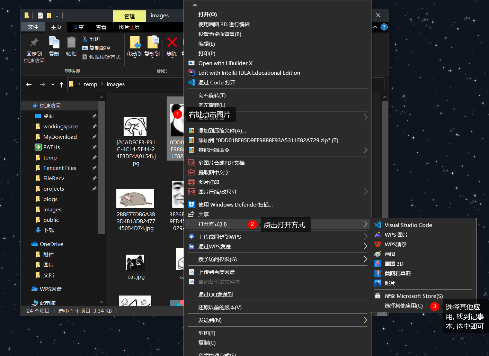
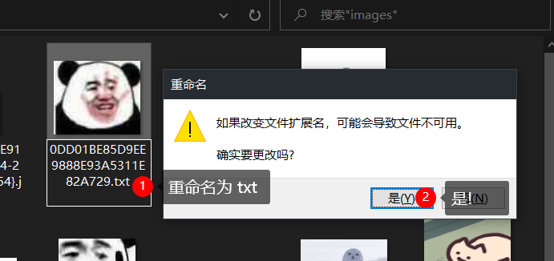
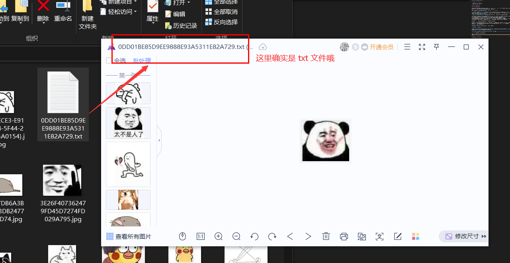
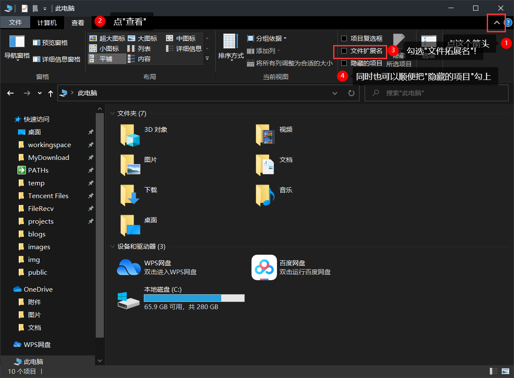
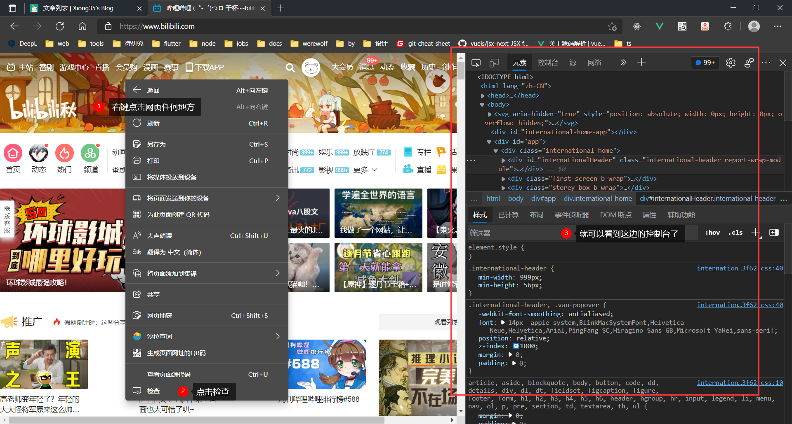
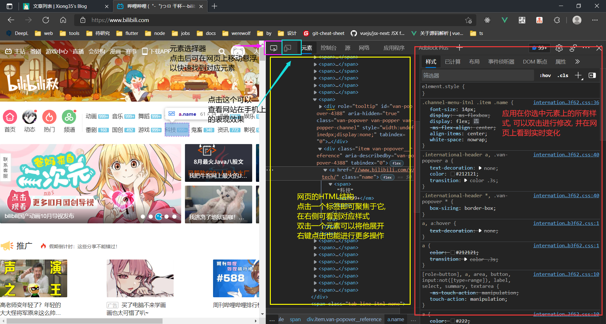
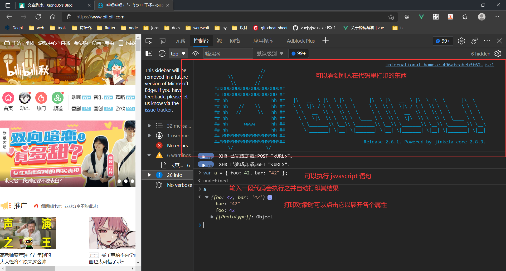

# 纯小白也能看懂的前端 Tips

> 关键词: 指北, 前端杂谈

一篇写给纯小白的前端经验书

## 如何显示文件拓展名

### 什么是文件拓展名

你可能隐约已经知道了很多文件拓展名, 比如 `txt`, `png`, `docx`, `pdf`, `mp3` 等等等等, 林林总总有这么多
拓展名, 他们是干什么用的呢? 不同的文件拓展名有什么区别呢?

首先, 你可以认为电脑上的文件只有两种, **文本文件**和**二进制文件**

二进制文件是在电脑里用 0, 1 进行编码的文件, 他们把信息(如图片, 音频等)用高效的存储方式**编码为二进制**, 存在
电脑里, 打开的时候**需要用对应的方式解码**, 比如 `png` 要用图片查看器打开, `mp3` 要用音乐播放器打开等等, 正
是这些软件能解码对应的特定类型的文件.  
**不同的二进制文件编码方式不同**. 如果你尝试用音乐播放器打开一张图片, 肯定是不会识别出来的

文本文件就是直接记录人能阅读的字符的文件, 如`txt`, 但是 `ppt` 或者 `pdf` 文件不是文本文件, 虽然你打开
他也能看到人能阅读的字符, 但是正如上文所说, 这是需要被解码出来才能看到的信息  
常见的文本文件有`txt`, 但是对于我们程序员来说, 最常见的文本文件就是各种代码的源文件了  
尽管文本文件的后缀名多种多样, 但是他们的**编码方式都是一样的**, 就是纯文本, 所以你可能听说过有人能用
记事本写代码, 这其实并不困难, 只需要用记事本打开一个源代码文件, 编辑他, 保存他, 就可以了!

说了这么多, 为什么明明只有两种文件类型, 却有这么多拓展名呢?

拓展名只是为了告诉电脑我这个文件**最好**用什么软件打开. 每种文件都有一个默认打开方式, 你双击它就会用
默认方式打开, 如果你细心的话会注意到当你下载 WPS 后他会问你是否要设置 `ppt`, `doc` 等文件默认
用 WPS 打开, 就是在设置这个东西

既然有默认, 那就有特例. 你想用记事本打开图片吗, 没问题!

会发生什么? 你看到了一堆奇怪的字符是吗? 没错, 记事本打开文件之后只会把他当成文本文件解析, 用解码文本
文件的方式解码二进制文件, 就会得到错误且奇怪的结果!

再来一个特例, 假如你把图片的后缀名改成 txt, 还能打开图片吗?

> **如果你没有进行过设置, 可能改了半天只改了文件名, 而没有改掉拓展名**. 改拓展名需要先按本章第二部分要讲的
> 如何显示文件拓展名的方法显示出拓展名再改. 否则 windows 会觉得你不够专业, 不够清楚自己在做什么, 而
> 不让你改拓展名, 本章就是要学会拓展名, 让 windows 不敢教你做事!  
> 你可以先假装自己能改, 跟着看下去, 等看完了第二章再回来试试!

这时候你双击他, 会用 txt 文件默认的打开方式: 记事本打开, 得到的同样是乱码. 非常合理, 毕竟 `txt` 这个后缀
名全部的也是唯一的意义就在于告诉全天下: `我是个文本文件, 请用解析文本文件的方法打开我!`

我们现在强制用打开图片的方法打开他! 像上面一样, 右键点击文件, 点击"打开方式", 在更多打开方式里找到
一个能打开图片的软件(如 wps 看图, windows 图片, 光影看看 等等等等)打开他!

你会发现同样打开了!

总结一下:

- 文件只有两种, 二进制和纯文本
- 后缀名只是为了让电脑找到合适的软件打开文件
- 后缀名是什么不会影响文件的内容, 用合适的方法同样可以打开

### 显示所有文件的拓展名

对于基础使用者, 可能觉得让 windows 自己决定用什么方式打开文件就行, 但是很多时候你需要知道一个文件
的具体信息, 需要用别的方式打开文件, 需要不被 Windows 限制! 这时候, 你可以配置 windows 让他显示所有的
拓展名, 卸下不让你更改拓展名的限制!

**随便打开一个文件夹, 进行以下操作:**

ok, 你现在既可以看到文件名, 也可以随意改文件名了! coooool!

> 所以说了这么多其实就是简单的三四步是吗  
> 是的.....

## 如何打开浏览器控制台

浏览器其实有很多很强大的功能, 其中一个就是**控制台**. 作为前端开发者, 你**必须**学会使用控制台

首先, 你需要一个好一点的浏览器, 在这里推荐用 Edge 或者 Chrome.

> 所谓好一点是指: 没有乱七八糟的弹窗广告, 有较好的性能, 有完整的未被阉割的控制台功能, 没有奇
> 怪的 css 样式, 兼容较新的 css 和 js 语法

右键点击网站任何一个地方, 点击"检查", 即可打开控制台  
也可使用快捷键, 按 `F12` 键就能打开它

## 介绍控制台

对萌新来说, 控制台有两个重要部分:

> 有的浏览器此处是英文, Edge 和最新版 Chrome 这里是中文, 在此给出对应关系

- 元素(Element): 能看当前网页的 HTML 结构和代码
- 控制台(Console): 能在这里执行 JS 代码, 看到打印的结果

### 元素(Element)

要善用这四个部分!!!

### 控制台(Console)

也要善用控制台 debug!

当你的 JS 代码出 bug 时, 不妨多写几句 `console.log(你正在调试的关键对象)`, 然后在控制台里
检查每次打印的结果是否符合预期  
比如你期望某个变量这时候是个对象, 但是打印的时候发现打印出了`undefined`, 你
就可以在此部分之前的代码中再打印几句, 看看是从哪里开始程序变得不符合预期的, 这个地方没准就是 bug!

---

祝你学的开心!
