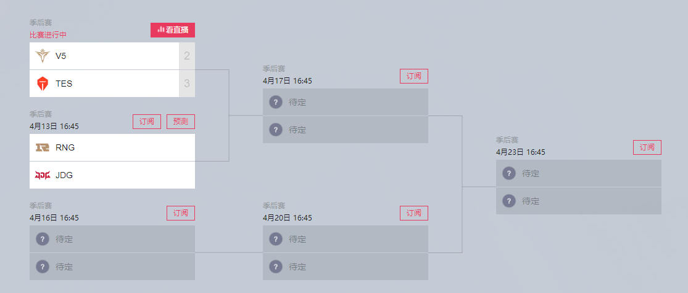

# 2022-04-12 腾讯游戏发布面试

> 问了下是负责 lol 比赛相关界面的部门, 有点意思

## 一面

1. **请从下面选项中, 选出可能是内网接口的选项**(问这题就很离谱...要我说其实都有可能..看你路由器和 dns 怎么配)

   1. www.oa.com/login -> 可能性比较低, 直接用域名访问的
   2. 192.168.99.8/login -> 可能性很高, 使用的是网关内 ip
   3. www.qq.com/login -> 可能性极低, 用的是很正常的线上域名
   4. lol.qq.com/login -> 可能性极低, 用的是很正常的线上域名
   5. 113.108.77.66/login -> 可能性极低, 用的是没掩码的正常 ip
   6. <http://53458:90832/login> -> 这不像是正经路由? 要么是错误的路由要么是内网奇妙的解析方式

2. **封装 wx.request 为 Promise**, 简单啦

   ```js
   wx.request({
     url: "example.com",
     data: { x: "", y: "" },
     success(res) {
       // 接口请求成功后，回调该函数
     },
     fail(e) {
       // 接口请求失败后，回调该函数
     },
   });

   function request(url, data) {
     return new Promise((resolve, reject) => {
       wx.request({
         url,
         data,
         success: resolve,
         fail: reject,
       });
     });
   }

   // request函数的使用示例
   async function getUserInfo() {
     // 希望request实现promise的使用效果
     const resp1Promise1 = request("example.com", { id: 1 });
     const resp1Promise2 = request("example.com", { id: 1 });
     const resp1Promise3 = request("example.com", { id: 1 });

     const [res1, res2, res3] = await Promise.allSettled([
       resp1Promise1,
       resp1Promise2,
       resp1Promise3,
     ]);
   }
   ```

3. **选择这个网络请求最可能的对应 Web 文件目录**: <https://lol.qq.com/data/getimg/?pic=teemo&size=720>

   1. c:\www\data-getimg\
   2. c:\www\data\getimg\pic\teemo\size\720\
   3. c:\www\data\getimg\
   4. c:\www\data\getimg\pic\teemo.jpg

   啊这, 我觉得都有可能啊, 第一个可能性倒是很小, 剩下的其实都有可以吧...后端要是 nginx, 那一般来说应该是 4, 但要是反向代理由别的程序解析那其实解析成啥都有可能啊...  
    后面就跟他扯了一下 nginx 怎么配, 说了一下我在自己服务器上部署前后端项目的流程, alias root proxy_pass 啥的

4. **说说这里的数据结构你想怎么定义**(腾讯会议的 ide 没有 ts, 只能用 js 了...)

   

   ```js
   const match = {
     id: 1,
     teams: [
       {
         id: 1,
         name: "TES",
         point: 2,
       },
       {
         id: 1,
         name: "V5",
         point: 2,
       },
     ],
     time: Date.now(),
     /** enum 的比赛状态, 未开始/进行中/已结束 */
     matchState: 0,
     /** 第几轮 */
     turn: 1,
     dataUrl: "http://xxx",
     videoUrl: "http://xxx",
     liveUrl: "http://xxx",
     type: "双败赛",

     preMatches: [match, match],
   };

   // 追问我要渲染到界面应该用什么数据结构好, 我说像下面这样自底向上这样可能会更好渲染
   // 进而和他解释上面这么写对后端来说容易存储一些, 处理数据还是前端做好一些, 降低服务器性能开销, 同时返回原始数据也能让接口更通用
   // 前端负责吧上面存在数据库里的样子解析成下面这样适合从左往右渲染到界面上的数据结构更合理
   const matches = [[match1, match2], [match3]];
   ```

5. **你为什么学前端**, 答: 我觉得有意思
6. **你觉得你持续学前端的动机是什么**, 答想挣钱找工作完成 kpi 完成公司希望你完成的项目, 面试官不满意追问: 更深层次的目的是啥? 啊, 我就是想挣钱啊...那要说的话就是为前端生态圈做点贡献, 让后来人学的更轻松少走弯路就行, 输出博客翻译文章之类的, 他差不多满意了

## 二面

聊人生
