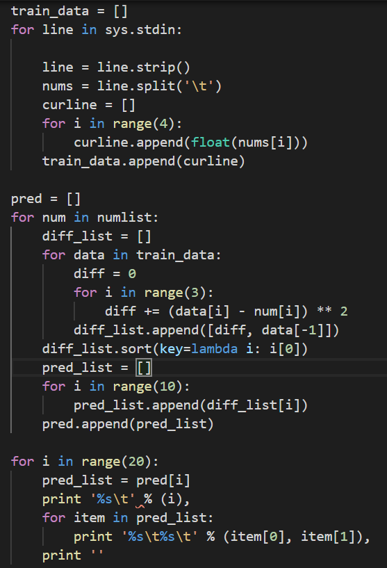
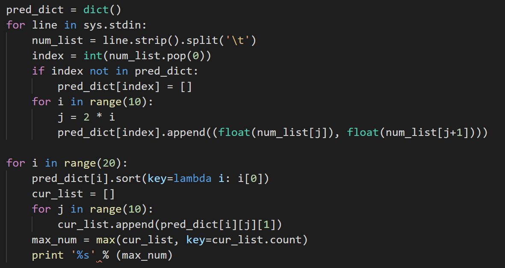
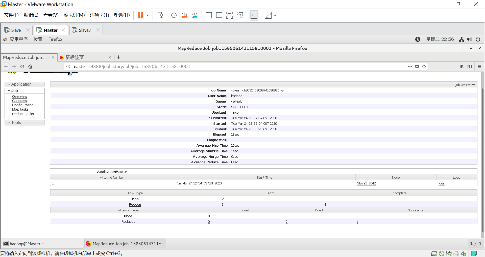
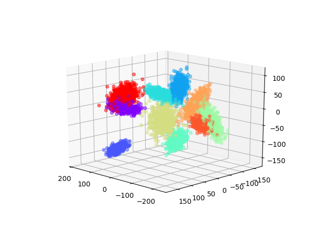

# 利用hadoop实现分布式KNN算法

## hadoop环境搭建

参考[这篇文章](http://dblab.xmu.edu.cn/blog/install-hadoop-cluster/)

## 创建数据集

利用numpy随机生成一系列高斯分布的3维数据

## 利用Hadoop实现自定义脚本

先将数据上传到hdfs, 然后利用streaming包调用自己的脚本

```shell
hadoop jar /usr/local/hadoop/share/hadoop/tools/lib/hadoop-streaming-2.8.5.jar \
  -D stream.map.output.field.separator=, \
  -input /user/hadoop/input.txt \
  -output /user/hadoop/output \
  -mapper ~/cityMapper -file ~/cityMapper \
  -reducer ~/calAverage -file ~/calAverage\
```

## 编写python脚本




## 运行结果



可视化

